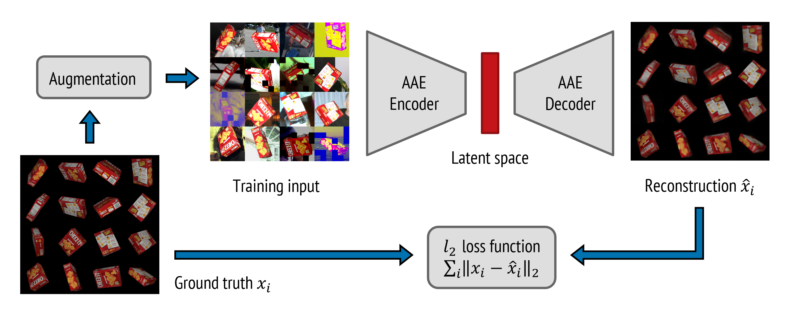
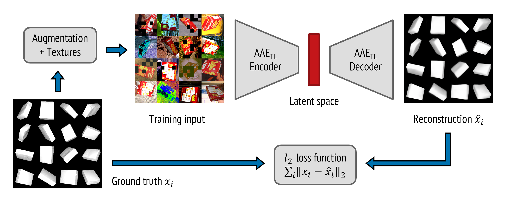
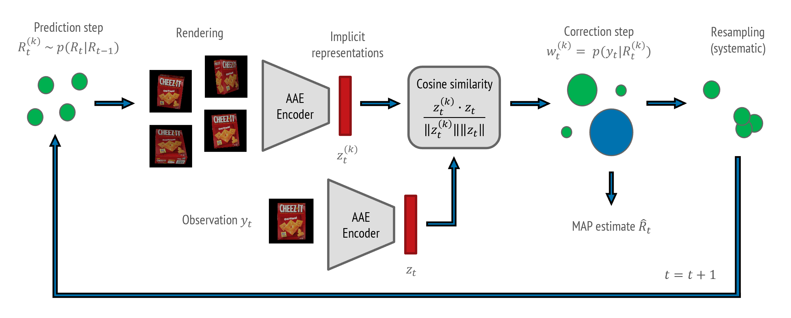
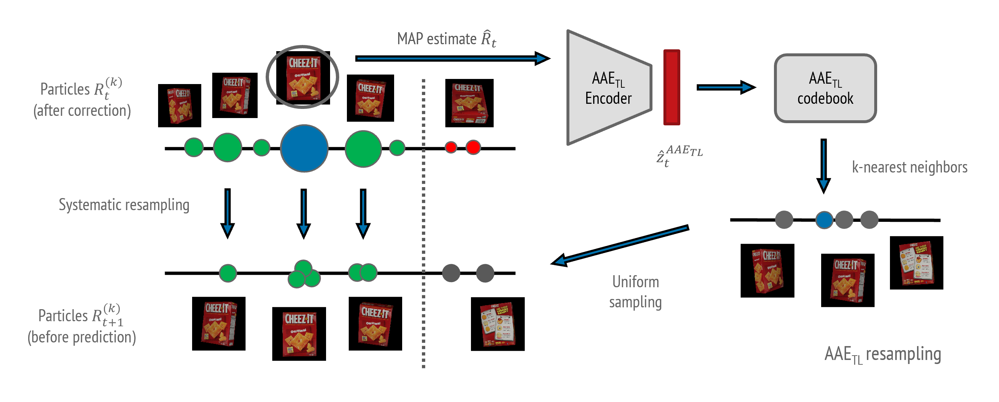
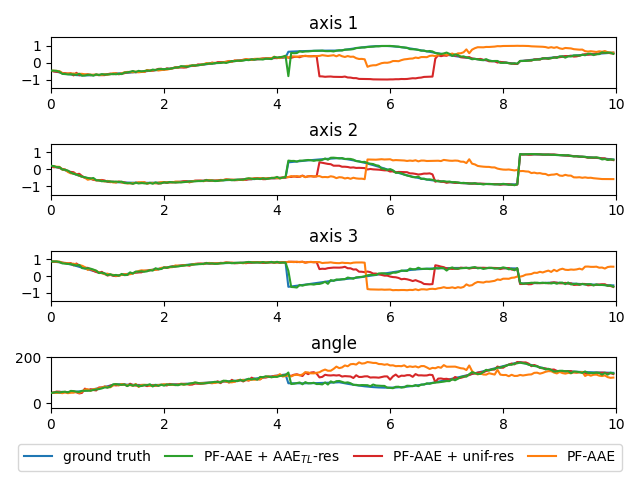
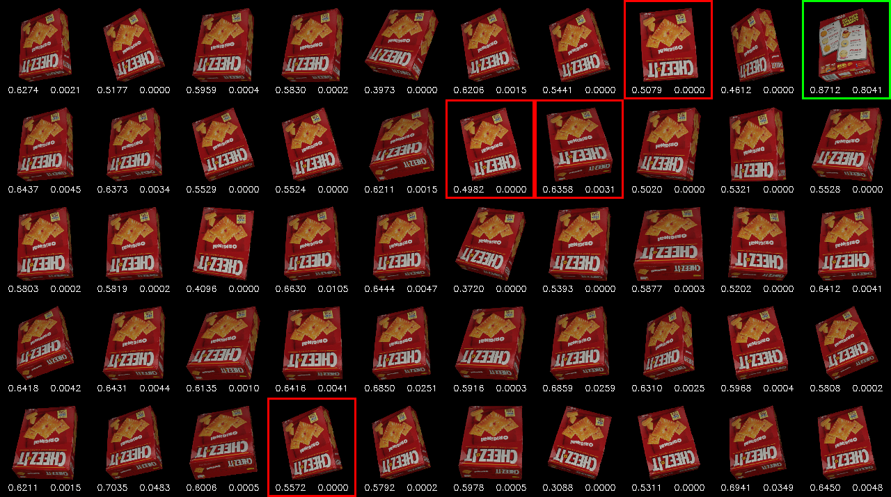
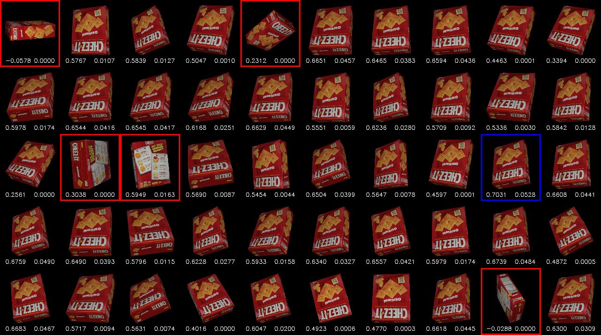

# PF-AAE: a particle filtering framework for 3D object pose tracking with RGB input


This project implements PF-AAE, a framework to perform tracking of the 3D pose of an object via particle filtering (PF) and augmented autoencoders (AAE). The filter iteratively estimates the posterior of the rotation matrix <em>R<sub>t</sub></em> given the RGB input <em>y<sub>1:t</sub></em>. The prediction step deploys a noise model in SO(3), while the correction step deploys a measurement model based on the AAE architecture. A novel resampling strategy called AAE<sub>TL</sub> resampling suggests an improvement of the tracking performance when the object undergoes abrupt changes of the pose. It relies on AAE<sub>TL</sub>, an augmented autoencoder trained with texture-less reconstruction objectives. The tracking procedure is carried out offline.

This work builts on the AugmentedAutoencoder repository, available [here](https://github.com/DLR-RM/AugmentedAutoencoder).

## Table of Contents

- [Installation](#installation)
- [Augmented Autoencoders](#augmented-autoencoders)
  - [AAE architecture](#aae-architecture)
  - [AAE<sub>TL</sub> architecture](#aae<sub>TL</sub>-architecture)
  - [Configuration file](#configuration-file)
  - [Training and embedding](#training-and-embedding)
- [PF-AAE architecture](#pf-aae-architecture)
  - [PF-AAE update](#pf-aae-update)
  - [AAE<sub>TL</sub> resampling](#aae<sub>TL</sub>-resampling)
  - [Tracking experiments](#tracking-experiments)
- [Run a demo](#run-a-demo)
- [Datasets](#datasets)
- [Code structure](#code-structure)
- [Acknowledgments](#acknowledgments)
- [License](#license)
- [References](#references)


## Installation

1. Install the code dependencies
```bash
pip install -r requirements.txt
```

2. Pip installation of the code
```bash
pip install --user .
```

3. Create the workspace (folder to collect AAE, AAE<sub>TL</sub>, PF-AAE data) 
```bash
export AE_WORKSPACE_PATH=/path/to/aae_workspace
mkdir $AE_WORKSPACE_PATH
ae_init_workspace 
```

4. Check the content of the workspace
```bash
└── aae_workspace
    ├── cfg
    │   └── train_template_aae.cfg
    │   └── train_template_aae_tl.cfg
    ├── cfg_eval
    ├── experiments
    └── tmp_datasets
```

## Augmented Autoencoders

Augmented autoencoders (AAEs) are convolutional autoencoders trained to reconstruct the view of an object from an augmented version of it fed as input. Thus, they deliver an implicit representation of rotations in their latent space. For further details, refer to the [original readme](README_AAE.md) of the AugmentedAutoencoder repository.

In this framework, it is possible to train two kinds of AAEs:

- AAE architecture: augmented autoencoder with textured reconstruction.
- AAE<sub>TL</sub> architecture: augmented autoencoder with texture-less reconstruction.

The former is more discriminative, while the latter maps views of the object that are symmetric without textures nearby in the latent space.

### AAE architecture



The image shows the AAE training procedure and the results obtained after 20000 training epochs.

### AAE<sub>TL</sub> architecture



The image shows the AAE<sub>TL</sub> training procedure and the results obtained after 20000 training epochs.

### Configuration file

The AAEs architectures are defined via a configuration file .cfg. Examples can be found in [auto_pose/ae/cfg](auto_pose/ae/cfg) or in the workspace, after its initialization.

In the configuration file must be defined the path to the 3D model of the object (MODEL_PATH). Moreover, it is required the path to a folder containing the images for the augmentation of the training input (BACKGROUND_IMAGES_GLOB). The datasets used for 3D models and background images are reported in section [Datasets](#datasets).

```bash
[Paths]
MODEL_PATH: /path/to/my_3d_model.ply
BACKGROUND_IMAGES_GLOB: /path/to/background/images/*.jpg
```

To enable the training of an AAE or an AAE<sub>TL</sub> architecture the TLESS_TARGET flag must be set as follow:

```bash
[Network]
TLESS_TARGET: False # for AAE training
TLESS_TARGET: True  # for AAE_TL training
```

For further details about the configuration files, refer to the [original readme](README_AAE.md) of the AugmentedAutoencoder repository.


### Training and embedding

1. Copy your configuration file `my_autoencoder.cfg` in the workspace

```bash
mkdir $AE_WORKSPACE_PATH/cfg/exp_group
cp path/to/your/my_autoencoder.cfg $AE_WORKSPACE_PATH/cfg/exp_group/my_autoencoder.cfg
```

2. Train the architecture

```bash
ae_train exp_group/my_autoencoder
```

3. Create the embedding (i.e., the codebook)
```bash
ae_embed exp_group/my_autoencoder
```

4. Check the content of the workspace
```bash
└── aae_workspace
    ├── cfg
    │   └── exp_group
    │       └── my_autoencoder.cfg
    └── experiments
        └── exp_group
            └── my_autoencoder
                └── checkpoints
                └── train_figures
```

## PF-AAE architecture

PF-AAE is a particle filter that performs the tracking of the 3D pose of an object from a sequence of images. It iteratively estimates the posterior of the object rotation matrix <em>R<sub>t</sub></em> given the RGB input, or observations, <em>y<sub>1:t</sub></em>.

This framework builts on the implementation of a particle filter offered by the [pfilter](https://github.com/johnhw/pfilter) repository.

### PF-AAE update



The image shows one iteration of PF-AAE. The prediction step moves the particles exploiting a noise model in SO(3) as state evolution model. The correction step builds the measurement model with an AAE encoder and its latent space. Namely, the rendered particles are compared with the observation via the cosine similarity. Then, a Gaussian kernel is applied as weighting function (not shown). As resampling procedure, it is possible to combine systematic resampling and AAE<sub>TL</sub> resampling (cf. the subsection [AAE<sub>TL</sub> resampling](#aae<sub>TL</sub>-resampling)).

The implemented noise models are `norm`, `unif-norm`, `predict`. The weighting function presents a parameter `gamma` that controls the discriminative behavior of the system. The resampling is performed when the effective number of particles is below a threshold `n_eff_threshold`. For further details, refer to [auto_pose/pf/pfilter_aae.py](auto_pose/pf/pfilter_aae.py).

### AAE<sub>TL</sub> resampling



With an AAE<sub>TL</sub> architecture trained on the same object of the AAE architecture employed in the filter, it is possible to use the AAE<sub>TL</sub> resampling. At each iteration, the portion `aae_resampling_proportion` of particles with the lowest weights is substituted with particles uniformly sampled from the `aae_resampling_knn` nearest neighbors of the MAP estimate in the AAE<sub>TL</sub> codebook. The other particles are resampled according to the systematic resampling procedure.

The codename of this resampling procedure is `aae-tl`. For comparison, also the `unif` resampling is implemented. It performs the sampling procedure uniformly in SO(3) instead of the codebook of AAE<sub>TL</sub>.

### Tracking experiments

1. Generate a sequence of views of the object

```bash
pf_generate_sequences exp_group/my_autoencoder \
    # sequence parameters (see below)
```

For the available parameters, refer to [auto_pose/pf/pf_generate_sequences.py](auto_pose/pf/pf_generate_sequences.py) and the section [Run a Demo](#run-a-demo).

2. Start tracking of the sequence

```bash
pf_tracking_sequences -aae exp_group/my_autoencoder \
    # tracking parameters (see below)
```

For the available parameters, refer to [auto_pose/pf/pf_tracking_sequences.py](auto_pose/pf/pf_tracking_sequences.py), [auto_pose/pf/pfilter_aae.py](auto_pose/pf/pfilter_aae.py), and the section [Run a Demo](#run-a-demo).

3. Check the results in the workspace

```bash
└── aae_workspace
    ├── experiments
    │   └── exp_group
    │       └── my_autoencoder
    │           ├── filtering
    │           │   └── sequence_name
    │           │       └── pf_tracking_name
    │           └── ...
    └── ...
```

In place of `sequence_name` and `tracking_name` will appear two strings that respectively identify the generated sequence and the tracking experiments, along with their parameters.


## Run a demo

1. Edit the first two lines of [demo/cfg/aae/cracker.cfg](demo/cfg/aae/cracker.cfg) and [demo/cfg/aae/cracker.cfg](demo/cfg/aae_tl/cracker.cfg). MODEL_PATH must be the path to the YCB cracker_box model, available in [demo/obj_000002.ply](demo/obj_000002.ply). BACKGROUND_IMAGES_GLOB must be the path to the Pascal VOC2012 dataset, available [here](http://host.robots.ox.ac.uk/pascal/VOC/voc2012/).

```bash
[Paths]
MODEL_PATH: /path/to/obj_000002.ply
BACKGROUND_IMAGES_GLOB: /path/to/voc12/VOCdevkit/VOC2012/JPEGImages/*.jpg
```

2. Copy the configuration files in [demo/cfg](demo/cfg) in the workspace

```bash
cp -r demo/cfg $AE_WORKSPACE_PATH
```

3. Training and embedding of the AAE architecture for the YCB cracker_box

```bash
ae_train aae/cracker # NB: ~8 hours with a K40 GPU
ae_embed aae/cracker
```

4. Training and embedding of the AAE<sub>TL</sub> architecture for the YCB cracker_box

```bash
ae_train aae_tl/cracker # NB: ~8 hours with a K40 GPU
ae_embed aae_tl/cracker
```

5. Generate a sequence with a backflip of the object at 4.2 seconds. Then, run 3 tracking experiments on it: one with AAE<sub>TL</sub> resampling, one with uniform resampling, and one without AAE<sub>TL</sub> and uniform resampling. 

```bash
cd demo
./pf_aae_example.sh
```

6. Results in `$AE_WORKSPACE_PATH/experiments/aae/cracker/filtering`

The following animation shows from left to right:

- the input sequence (generated)
- the output of the PF-AAE w/ AAE<sub>TL</sub> resampling (rendered)
- the output of the PF-AAE w/ uniform resampling (rendered)
- the output of the PF-AAE w/o AAE<sub>TL</sub> and uniform resampling (rendered)


The following figure compares the ground truth 3D poses of the object in the input sequence with the ones estimated by the 3 tracking experiments. Poses are expressed with their axis-angle representations.



The following figures show the (rendered) particles of the filters when the backflip occurs. For each particle:

- bottom left: the cosine similarity with the observation y<sub>t</sub>
- bottom right: the weight of the particle

The meanings of the colors of the borders are the following:

- black: particles obtained with the prediction step
- red: particles obtained with AAE<sub>TL</sub>  or uniform resampling
- blue: MAP estimate that comes from a particle obtained with the prediction step
- green: MAP estimate that comes from a particle obtained with AAE<sub>TL</sub> or uniform resampling

Particles of PF-AAE w/ AAE<sub>TL</sub> resampling when the backflip occurs (4.2 s):



Particles of PF-AAE w/ uniform resampling when the backflip occurs (4.2 s):



## Datasets

This work has been tested with the following two datasets:

- [YCB_Video](https://rse-lab.cs.washington.edu/projects/posecnn/): used for the 3D models of the objects being tracked.
- [Pascal VOC 2012](http://host.robots.ox.ac.uk/pascal/VOC/voc2012/): used for the augmentation of the input images during training.

We use [Pyrender](https://github.com/mmatl/pyrender) + EGL for object rendering.  Differently from the original AugmentedAutoencoder code, this renderer permits to use 3D models with textures. Please, make sure that the mesh vertices are expressed in meters before launching the training procedure.

## Code structure

The main changes from the original AugmentedAutoencoder code are in the following files:

```bash
├── auto_pose
│   ├── ae
│   │   ├── ae_latent_exploration.py
│   │   ├── ae_latent_study.py
│   │   ├── cfg
│   │   │   └── train_template_aae.cfg
│   │   │   └── train_template_aae_tl.cfg
│   │   └── ...
│   ├── pf
│   │   ├── pf_generate_sequences.py
│   │   ├── pfilter_aae.py
│   │   ├── pfilter.py
│   │   ├── pf_tracking_sequences.py
│   │   └── utils.py
│   ├── renderer
│   │   └── renderer.py
│   └── ...
├── scripts
│   ├── ae_embedding
│   ├── ae_latent_exploration
│   ├── ae_latent_study
│   ├── ae_training
│   ├── pf_sequences
│   └── pf_tracking
├── setup.py
└── ...
```

We provide hereafter a brief overview of the code structure:

- [auto_pose/ae](auto_pose/ae) contains some new code to train and study the AAE<sub>TL</sub> architecture, along with the original AAE.
- [auto_pose/pf](auto_pose/pf) contains the main code that implements the PF-AAE architecture.
- [auto_pose/renderer](auto_pose/renderer) contains the interface with Pyrender, which supports textured models.
- [scripts](scripts) contains some examples of shell scripts to configure and use the PF-AAE, AAE, AAE<sub>TL</sub> architectures.

We refer to the code documentation for more details.

## Acknowledgments

This project has been developed during my internship at the Istituto Italiano di Tecnologia (IIT), within the Humanoid Sensing and Perception group (HSP). I am sincerely thankful to my supervisors for all their support and suggestions to carry out the work.

## License 

This code is licensed under MIT License, see the [LICENSE](./LICENSE) file for more details.

## References

[1] Martin Sundermeyer, Zoltan-Csaba Marton, Maximilian Durner, Manuel Brucker, and Rudolph Triebel, Implicit 3D Orientation Learning for 6D Object Detection from RGB Images, The European Conference on Computer Vision (ECCV), September 2018.

[2] Xinke Deng, Arsalan Mousavian, Yu Xiang, Fei Xia, Timothy Bretl, and Dieter Fox, PoseRBPF: A Rao–Blackwellized Particle Filter for 6-D Object Pose Tracking, 2019.

[3] Simo Särkkä, Bayesian Filtering and Smoothing. Cambridge University Press, USA. 2013.